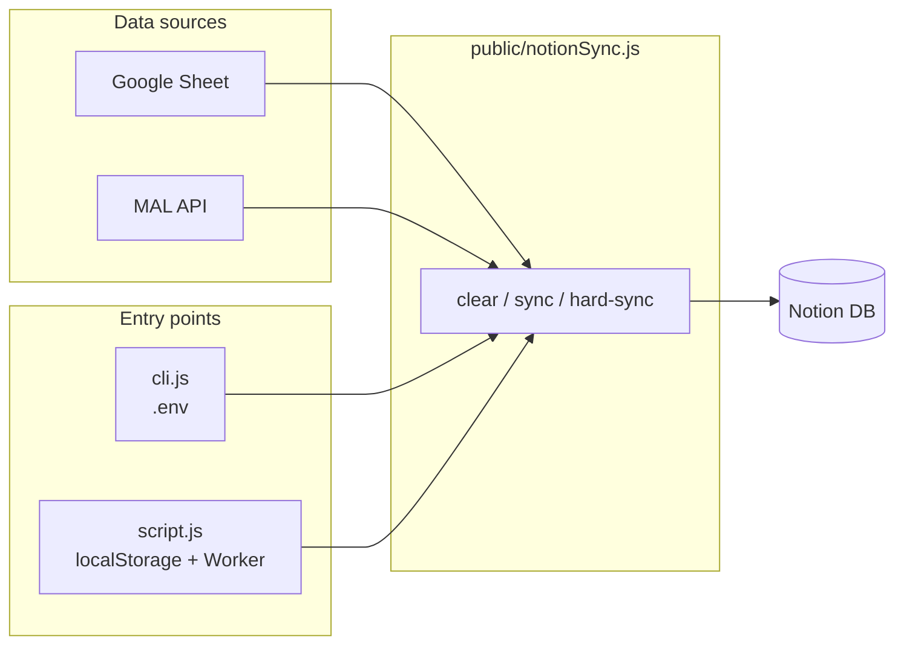
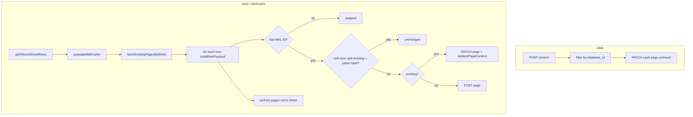
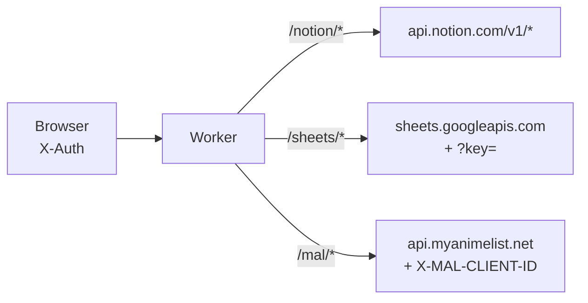

# Agent context: sync app

For AI agents working on this sync app. User-facing "what to do" is in **README.md** (this folder). This file contains everything needed to navigate and reason about the sync app without reading function bodies.

---

## Project layout (this folder: sync/)

```
sync/
├── AGENT_CONTEXT.md          # this file
├── README.md                 # user docs (CLI + Web UI)
├── package.json              # "cli": "node cli.js", dotenv
├── cli.js                    # CLI entry: reads .env, runAction(clear|sync|hard-sync)
├── cloudflare/
│   └── worker.js             # Worker: /notion, /sheets, /mal → upstream APIs
└── public/
    ├── index.html            # UI shell, buttons, config panel, progress, stats
    ├── script.js             # UI logic: config (localStorage), buttons → notionSync
    ├── notionSync.js         # Sync orchestration (sheet, MAL, Notion API); shared by CLI and UI
    ├── notionPageUtils.js    # Page body blocks, rich_text helpers, replacePageContent (injected fetch)
    ├── syncUtils/
    │   ├── stats.js          # createStats, reportProgress
    │   └── rowPayload.js     # MAL URL key, sync hash, buildRowPayload
    └── config.template.js    # (if present) template for worker URL etc.
```

- **Entry points:** `cli.js` (Node, `node cli.js` or `npm run cli`), `public/` (static app, `script.js` + `index.html`).
- **Sync orchestration:** `public/notionSync.js`. **Page blocks + property shapes:** `notionPageUtils.js`. **Row/hash/payload:** `syncUtils/rowPayload.js`; **progress stats:** `syncUtils/stats.js`.



---

## Config

**Config object** passed into every notionSync function. Keys are UPPERCASE; optional callbacks for progress/stats.

| Key | Required (CLI) | Required (UI) | Description |
|-----|----------------|---------------|-------------|
| `NOTION_TOKEN` | ✓ | — | Notion integration token (CLI/direct only; worker has it for UI) |
| `GOOGLE_API_KEY` | ✓ | — | Google API key, Sheets API (CLI/direct only) |
| `MAL_CLIENT_ID` | ✓ | — | MAL API client ID (CLI/direct only) |
| `DATA_SOURCE_ID` | ✓ | ✓ | Notion data source ID (parent for new pages) |
| `NOTION_DATABASE_ID` | ✓ | ✓ | Notion database ID (query/search target) |
| `SHEET_KEY` | ✓ | ✓ | Google Sheet ID |
| `SHEET_TAB_NAME` | optional | optional | Default `'Anime List (Statistics Version)'` |
| `MAL_USER_NAME` | optional | optional | Default `'Uji_Gintoki_Bowl'` |
| `WORKER_URL` | — | ✓ (in defaults) | Base URL of Cloudflare Worker (UI only) |
| `PASSWORD` | — | ✓ | Sent as `X-Auth`; must match worker `AUTH_PASSWORD` |
| `NOTION_DATA_SOURCE_ID` | optional | optional | Overrides `DATA_SOURCE_ID` for page creation if set |
| `onProgress(done, total, label)` | optional | optional | Called during long ops (e.g. Syncing 5/100) |
| `onStats(stats)` | optional | optional | Called with `{ created, updated, unchanged, archived, skipped, errors }` |

- **CLI:** Builds config from `process.env` + `DEFAULTS` in `cli.js`. Required env: `SHEET_KEY`, `GOOGLE_API_KEY`, `MAL_CLIENT_ID`, `NOTION_TOKEN`, `DATA_SOURCE_ID`, `NOTION_DATABASE_ID`. Exits with message if any missing.
- **UI:** Builds config from `localStorage` key `notion_sync_config` + `DEFAULTS` in `script.js`. Only `PASSWORD` is required in UI; worker URL and IDs come from DEFAULTS unless overridden. Config panel: `FIELDS` in script.js (currently only `cfg-password` → `PASSWORD`).

---

## Google Sheet format

- **Range:** `{SHEET_TAB_NAME}!A2:N` (rows 2 onward, columns A–N → indices 0–13).
- **Row filtering:** Rows with empty `row[2]` are skipped (no title = skip).
- **Column usage in buildRowPayload / buildRowKey:**

| Index | Usage |
|-------|--------|
| 2 | Title / anime name |
| 3 | Score (number; also stored as score×10 for "Score Out of 100") |
| 4 | Watch year (number) |
| 5 | Release year (number) |
| 7 | Caught up (string `'TRUE'` → Yes) |
| 12 | MAL link URL (used to extract MAL ID via `/anime/(\d+)/`) |
| 13 | Notes (My Comments body) |

Unused in sync: 0, 1, 6, 8, 9, 10, 11.

---

## Notion schema (anime database / data source)

- **Page parent:** New pages are created with `parent: { data_source_id: resolvedDataSourceId }` where `resolvedDataSourceId = config.NOTION_DATA_SOURCE_ID ?? config.DATA_SOURCE_ID`.
- **Properties** (set by buildRowPayload):  
  `Title` (title), `Given Score`, `Score Out of 100`, `Watch Year`, `Release Year`, `MAL Score` (number), `Caught up?` (select Yes/No), `MAL Link` (url), `Cover` (files), **`MAL Official Title`**, **`English Title`**, **`Japanese Title`** (all rich_text / Notion **Text** — from MAL `title` and `alternative_titles.en` / `.ja`), **`ID`** (number, MAL ID), **`Sync Hash`** (rich_text). Optional `icon` (external image URL) when cover exists.
- **ID / Sync Hash:** Used only for diffing. **ID** = MAL anime ID from URL. **Sync Hash** = FNV-1a hash of payload (**properties before** the three MAL title fields + children + icon) — **`MAL Official Title` / `English Title` / `Japanese Title` are not hashed** so MAL metadata changes alone do not flip the hash. When querying, code also accepts `userDefined:ID` for **ID**.
- **Page body (blocks):** Built by **`buildAnimePageChildren`** in `notionPageUtils.js` (headings + paragraph blocks; extend there for richer styling).

---

## notionPageUtils.js — page body, property shapes, block append

**File:** `public/notionPageUtils.js`

- **splitTextIntoParagraphs(text, chunkSize = 1800):** Paragraph blocks from plain text (≤ `chunkSize` chars per block).
- **buildAnimePageChildren({ notesText, malSynopsisText }):** `children` for create/PATCH: "My Comments", notes, "MAL Synopsis", synopsis, etc.
- **notionRichTextProperty(value):** `{ rich_text: [...] }` for Notion Text columns.
- **replacePageContent(pageId, children, config, stats, { notionHeaders, apiFetchNotionRetry }):** PATCH `blocks/{pageId}/children` with new body (after page `erase_content`). Injects Notion fetch helpers from `notionSync.js`.

---

## syncUtils/rowPayload.js — sheet row → payload + hash

**File:** `public/syncUtils/rowPayload.js`

- **extractMalIdFromUrl, buildRowKey, computeRowHash, buildRowPayload(row, malCache)** — see "Google Sheet format" / "Notion schema".

---

## syncUtils/stats.js

**File:** `public/syncUtils/stats.js` — **createStats**, **reportProgress** (used by `notionSync.js` and clear flow).

---

## notionSync.js — exports and internal behavior

**File:** `public/notionSync.js`

### apiFetch (internal, not exported)

- **Signature:** `apiFetch(url, options = {}, config = {})`.
- **Behavior:** If `config.WORKER_URL` is set: rewrite URL and send `X-Auth: config.PASSWORD`; strip `Authorization` and `X-MAL-CLIENT-ID` from options. Rewrites:
  - `https://api.notion.com/v1*` → `{WORKER_URL}/notion*`
  - `https://sheets.googleapis.com*` → `{WORKER_URL}/sheets*` (and strip `?key=...`)
  - `https://api.myanimelist.net*` → `{WORKER_URL}/mal*`
- If no `WORKER_URL`, uses `fetch(url, options)` as-is (CLI adds `Authorization` and `X-MAL-CLIENT-ID` via notionHeaders / MAL calls).

### apiFetchNotionRetry (internal)

- **Signature:** `apiFetchNotionRetry(url, options, config)`.
- Wraps **`apiFetch`**: on **429 / 502 / 503 / 504**, waits with exponential backoff (base 500ms, cap 16s) and retries, **max 5 attempts total** — not infinite. Other status codes return immediately. Used for **PATCH page** (properties + `erase_content` + icon) and **append block children** in **`replacePageContent`** (`notionPageUtils.js`).

### getSheetData (internal)

- GET `https://sheets.googleapis.com/v4/spreadsheets/{SHEET_KEY}/values/{SHEET_TAB_NAME}!A2:N`. With worker: no query param; without worker: `?key={GOOGLE_API_KEY}`. Returns `data.values` (array of rows) or `[]`.

### populateMalCache (exported)

- **Signature:** `populateMalCache(config) → Promise<Record<string, cacheEntry>>`.
- Paginated GET MAL `v2/users/{MAL_USER_NAME}/animelist?fields=id,title,synopsis,mean,main_picture,alternative_titles&nsfw=true&limit=500&offset=0`. Follows `paging.next`. Cache includes `officialTitle`, `altEn`, `altJa`, `synopsis`, etc. Throws on non-OK response.

### fetchExistingPagesByMalId (internal)

- POST Notion `databases/{NOTION_DATABASE_ID}/query` (paginated, page_size 100). For each result: read property **ID** (or **userDefined:ID**) as number, **Sync Hash** as rich_text[0].plain_text. Returns `{ pagesByMalId: { [malIdKey]: { pageId, syncHash } }, pagesWithoutMalId: Set<pageId> }`. If no `NOTION_DATABASE_ID`, returns empty structures.

### Other internals

- **notionHeaders(config):** Returns `Notion-Version: 2022-06-28`, Content-Type, accept; if !WORKER_URL and NOTION_TOKEN, adds `Authorization: Bearer {NOTION_TOKEN}`.
- **getFilteredSheetRows(config):** getSheetData then filter rows where row[2] non-empty.
- **archiveNotionPage(pageId, config):** PATCH page archived, returns res.ok.
- **createNotionPage(resolvedDataSourceId, payloadCore, config, stats, logLabel):** POST page, updates stats.created or stats.errors, logs on error.

Row/hash/payload helpers live in **`syncUtils/rowPayload.js`**; stats helpers in **`syncUtils/stats.js`**; **`replacePageContent`** in **`notionPageUtils.js`** (sync passes `notionHeaders` + `apiFetchNotionRetry`).

### Action flow (clear / soft sync / hard sync)

Shared row loop is **`runNotionSync(config, { respectHash, progressLabel })`** (internal). **`syncToNotion`** = soft (`respectHash: true`); **`hardSyncToNotion`** = hard (`respectHash: false`). Rows are processed in **spreadsheet order** (filtered sheet rows).



### clearNotionDatabase (exported)

- **Signature:** `clearNotionDatabase(config)`.
- POST Notion `v1/search` (paginated), filter results by `parent.database_id === NOTION_DATABASE_ID` (compact, no hyphens). Collect all page IDs, then PATCH each `pages/{id}` with `{ archived: true }`. Calls onProgress and onStats (archived / errors).

### syncToNotion (exported) — soft sync

- **Signature:** `syncToNotion(config)`.
- Calls `runNotionSync` with `respectHash: true`, progress label `Soft syncing`. Same as below; **skips** Notion writes when existing page’s stored **Sync Hash** matches the newly computed hash → **unchanged**.

### hardSyncToNotion (exported) — hard sync

- **Signature:** `hardSyncToNotion(config)`.
- Calls `runNotionSync` with `respectHash: false`, progress label `Hard syncing`. Same pipeline as soft sync (fetch index, create/update/archive missing from sheet), but **never** takes the unchanged shortcut: every row with a MAL ID triggers PATCH + `replacePageContent` if the page exists, or POST if new. **Sync Hash** on each page is still updated from the latest payload. Expect **updated** ≈ row count (minus skips); **unchanged** stays 0.

---

## API calls (reference)

| Service | Method | Endpoint / usage |
|---------|--------|-------------------|
| Google | GET | `sheets.googleapis.com/v4/spreadsheets/{id}/values/{range}` (?key= when direct) |
| MAL | GET | `api.myanimelist.net/v2/users/{user}/animelist` (paginated, X-MAL-CLIENT-ID) |
| Notion | POST | `api.notion.com/v1/search` (clear: collect page IDs by database_id) |
| Notion | POST | `api.notion.com/v1/databases/{id}/query` (sync: pagesByMalId) |
| Notion | PATCH | `api.notion.com/v1/pages/{id}` (update properties/icon; sync updates use **`erase_content: true`** to clear body before append; archived: true for clear) |
| Notion | POST | `api.notion.com/v1/pages` (create; parent data_source_id) |
| Notion | GET | `api.notion.com/v1/blocks/{id}/children?page_size=100` (paginated) |
| Notion | PATCH | `api.notion.com/v1/blocks/{id}` (archived: true) |
| Notion | PATCH | `api.notion.com/v1/blocks/{id}/children` (body: { children }) |

---

## Cloudflare Worker

- **File:** `cloudflare/worker.js`. Deployed manually (paste in dashboard).
- **Auth:** Every request must have header `X-Auth` equal to env `AUTH_PASSWORD`; else 401.



- **Routes:** Path prefix → upstream:
  - `/notion/*` → `https://api.notion.com/v1/*` (injects Authorization, Notion-Version, Content-Type, accept)
  - `/sheets/*` → `https://sheets.googleapis.com/*` (adds `key` from env `GOOGLE_API_KEY`)
  - `/mal/*` → `https://api.myanimelist.net/*` (injects `X-MAL-CLIENT-ID`)
- **CORS:** Allow-Origin *, methods GET/POST/PATCH/PUT/DELETE/OPTIONS, headers Content-Type, X-Auth, Notion-Version, Authorization, accept.
- **Env (Worker secrets):** AUTH_PASSWORD, NOTION_TOKEN, GOOGLE_API_KEY, MAL_CLIENT_ID.

---

## UI (script.js + index.html)

**Files:** `public/script.js`, `public/index.html`

- **Config:** localStorage key `notion_sync_config`. Required key: `PASSWORD`. FIELDS: `{ id: 'cfg-password', key: 'PASSWORD', label: 'Password', type: 'password', required: true }`. DEFAULTS include WORKER_URL, SHEET_KEY, SHEET_TAB_NAME, MAL_USER_NAME, DATA_SOURCE_ID, NOTION_DATABASE_ID.
- **Buttons → actions (left to right):** btn-sync → syncToNotion (soft), btn-hard-sync → hardSyncToNotion (confirm dialog), btn-clear → clearNotionDatabase. All call `callAction(fn, label)` which checks config, resets stats, sets loading, calls `fn(getConfig())`, then sets status.
- **DOM IDs:** btn-sync, btn-hard-sync, btn-clear, btn-config, status-message, status-tag, config-panel, btn-save-config, cfg-warning, progress-wrap, progress-bar, st-created, st-updated, st-unchanged, st-archived, st-skipped, st-errors, cfg-password. **Hard sync** uses `.btn-caution` (muted burnt orange `#7c2d12`, aligned with other action buttons).
- **getConfig():** Merges DEFAULTS, loadConfig(), and adds onProgress (setProgress) and onStats (setStats). setProgress updates progress bar and status message; setStats writes to st-* elements.

---

## Stats (onStats callback)

Object with numeric fields (all optional): **created**, **updated**, **unchanged**, **archived**, **skipped**, **errors**. Meaning:

- **created** — New Notion page created.
- **updated** — Existing page patched (properties + blocks).
- **unchanged** — Row matched existing page, same sync hash; no write.
- **archived** — Page archived (clear: all; sync: MAL ID no longer in sheet).
- **skipped** — Row had no MAL ID; not written.
- **errors** — A Notion (or block) request failed.

---

## Error handling

- notionSync: Throws on getSheetData, populateMalCache, fetchExistingPagesByMalId, or **notionPageUtils.replacePageContent** failure (after retries where applicable). Those failures are caught in the sync loop (`console.error`); **stats.errors** is incremented inside **replacePageContent** for that failure.
- CLI: try/catch around runAction; logs error and process.exit(1).
- UI: callAction try/catch; sets status message to error string and status-tag to 'error'.

---

## Rate limiting

- `runNotionSync` (soft + hard): `ROW_DELAY_MS` (200) after each row that performs a create or update to reduce Notion 429 risk.
- **Body replace:** **`erase_content`** on page PATCH (one call) instead of archiving each block; then append children with retry.
